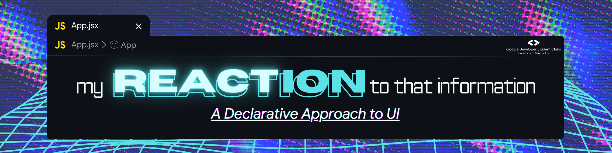

# gdsc-react-workshop



This workshop offers a one-day deep dive into React fundamentals, covering Component-based architecture, React State management, and JSX syntax.

## Usage

```bash
git clone https://github.com/Luzefiru/gdsc-react-workshop.git
cd gdsc-react-workshop
cd react
npm install
code .
```

## Tools of the Trade

Before we begin our journey into the vast ocean - that is the React ecosystem - we should adopt a few tools that will aid us in our journey.

### Git Bash & Git

- allows us to use the `git` command for Version Control and cloning online code repositories.
- allows us to use the Bash interpreter and scripting language with different useful CLI utilities.

#### Installation

1. See the installation guide for your platform [here](https://git-scm.com/downloads), otherwise skip this step if you are using Linux - you have Bash installed by default.
2. Follow [these steps](https://www.theodinproject.com/lessons/foundations-setting-up-git) to link your GitHub account to `git`.

### Node Version Manager, NodeJS, Node Package Manager

- allows us to use the `nvm`, `node`, and `npm` commands.
- NVM allows us to download and manage NodeJS versions.
- NodeJS is a JavaScript runtime and interpreter, allowing us to run JavaScript outside our Web Browsers.
  - the most popular runtime for JavaScript web servers.
- NPM allows us to manage different packages from the [npm Registry](https://www.npmjs.com/), like React.

#### Installation

1. FreeCodeCamp has a [nice tutorial](https://www.freecodecamp.org/news/node-version-manager-nvm-install-guide/) to install `nvm`.
2. Run `nvm install --lts && nvm use --lts` to install `node`.

### Visual Studio Code

- our text editor of choice due to ease-of-use and a rich extension marketplace.

#### Installation

- Choose the appropriate installer for your platform [here](https://code.visualstudio.com/download).

#### Prettier (VSCode Extension)

- a code formatter widely used in the industry to automatically format your code on save: _say goodbye to manually adjusting those whitespaces_!

#### Installation

1. While in VSCode, do `CTRL + SHIFT + X` to bring up the Extension Marketplace panel.
2. Search for _"Prettier - Code formatter"_ and click the `Install` button.
3. Do `CTRL + ,` to open your VSCode settings.
4. Search for _"format"_ in the search bar.
5. Set _"Editor: Default Formatter"_ to _"Prettier - Code formatter"_.
6. Enable _"Editor: Format On Save"_.

### Why is Modern JavaScript Like This?

_"Wait a second... I thought we only needed HTML, CSS, and JavaScript to develop websites. What's with all these extra complexities?"_

We did this in order to have:

- easy management of third-party packages.
- simpler bundling of code and various optimizations.
- TypeScript, static type-checking.
- task runners and easier configuration.

In short, we're here because we wanted to make the Developer Experience better and abstract trivial problems like manually linking, recompiling, and code minification.

Read about [Modern JavaScript](https://peterxjang.com/blog/modern-javascript-explained-for-dinosaurs.html) and how [NodeJS Resolves Modules](https://www.bennadel.com/blog/2169-where-does-node-js-and-require-look-for-modules.htm#:~:text=If%20the%20given%20module%20is%20not%20a%20core%20module%2C%20Node,level%20for%20a%20node_modules%20folder.).

## Why React?

1. we can think in Components - _building blocks_ - to compose our application.
   - allows us to reuse code more easily - enforcing the DRY principle.
   - all the display, logic, and styles into a single JSX file without splitting a part of our application in `.html`, `.css`, `.js` files.
2. we don't need to use DOM functions like `document.querySelector` or `Node.addEventListener`, but rather use a **Declarative** approach to building our apps.
   - this hides the complexity of long **Imperative** code.
   - we simply describe the expected _"shape"_ or _"form"_ of our UI and the React [Virtual DOM](https://legacy.reactjs.org/docs/faq-internals.html) will render it.
3. it prevents unnecessary re-renders of pages, only rendering components that need to change.
   - this isolates changes and improves app performance.

## Getting Started

First, let's create a React project with [Vite](https://vitejs.dev/guide/), a tool for quickly initializing React projects with convenient Developer Experience features like Hot Module Reload, fast build times, and multiple framework compatibilities.

```bash
# We can setup our project using an installation wizard
npm create vite@latest

# Or directly with this command, for a VanillaJS React project
npm create vite@latest my-react-app -- --template react

# We then change directory to our app and install dependencies
cd my-react-app
npm install
npm run dev # runs a server on http://localhost:5173
```

## Topics

- Project Structure
  - `/package.json`
  - `/src/components/`
- Thinking in React
- JSX
  - _"a JavaScript function that returns an HTML [DOM Element](https://developer.mozilla.org/en-US/docs/Web/API/Element)"_
  - gotchas like `className`, `htmlFor`, `camelCase` attributes.
  - capital `PascalCase` component function names.
  - escaping into JavaScript with curly braces `{}`.
- Components
  - Functional Components
    - `rfce`
  - Props
    - Code Reusability
    - Array Map Function
    - Prop Drilling
  - Conditional Rendering
- React Hooks
  - useState
  - useEffect
    - `componentDidMount`, `[]`
    - `componentDidUpdate`, `[dependency]`
    - `componentWillUnmount`, `return () => { cleanUp() }`
    - persisting state with `localStorage` Web Storage API
      - `localStorage.getItem('key')`
      - `localStorage.setItem('key', '{...jsonString}')`

### Go Beyond

- Type-checking Props
  - `prop-types`
- Routers (Multiple Pages)
  - `react-router`
  - `BrowserRouter`, `Router`, `<Route path="" element={} />`
    - wildcard `*` path.
  - `<Link to="" />`
  - useMatch Hook
- Fetching Data from Backend REST APIs
  - Promises
  - `axios`

## Project Showcase: Todo List

> This project was taken from [The Odin Project's Foundational JavaScript Course](https://www.theodinproject.com/lessons/node-path-javascript-todo-list), but adapted to be done with React.
>
> - all credits go to the open source contributors that devised the original project specs.

### Description

Todo lists are a staple in beginning webdev tutorials because they can be very simple. There is, however, a lot of room for improvement and many features that can be added.

Before diving into the code, take a minute to think about how you are going to want to organize your project.

### Project Specifications

> I recommend not to read everything or you might get overwhelmed, do each step one-by-one and solve them before continuing to the rest.

1. Your ‘todos’ are going to be objects that you’ll want to dynamically create, which means you'll have a helper function or something similar to create them.

```js
function createTodo(title, description, dueDate) {
  // your todo creation logic goes here
}

const newTodo = createTodo('Study React', 'Learn about Context', '11/40/2023');
```

2. Brainstorm what kind of properties your todo-items are going to have. At a minimum they should have a `title`, `description`, `dueDate` and `priority`. You might also want to include `notes` or even a `checklist`.

3. Your todo list should have `projects` or separate lists of `todos`. When a user first opens the app, there should be some sort of ‘default’ project to which all of their todos are put. Users should be able to create new projects and choose which project their todos go into.

4. The look of the User Interface is up to you, but it should be able to do the following:

   1. view all projects
   2. view all todos in each project (probably just the title and duedate… perhaps changing color for different priorities)
   3. expand a single todo to see/edit its details, possibly in a modal or its own dedicated page with React Router's `<Route path="/todo/:id" />`
   4. delete a todo

5. For inspiration, check out the following great todo apps. (look at screenshots, watch their introduction videos etc.)

   1. [Todoist](https://en.todoist.com/)
   2. [Things](https://culturedcode.com/things/)
   3. [any.do](https://www.any.do/)

6. Since you are probably already using Vite, adding external libraries from `npm` is a cinch! You might want to consider using the following useful library in your code:

   1. [date-fns](https://github.com/date-fns/date-fns) gives you a bunch of handy functions for formatting and manipulating dates and times.

7. (Optional) We haven’t learned any techniques for actually storing our data anywhere, so when the user refreshes the page, all of their todos will disappear! You should add some persistence to this todo app using the Web Storage API.

   1. `localStorage` ([docs here](https://developer.mozilla.org/en-US/docs/Web/API/Web_Storage_API/Using_the_Web_Storage_API)) allows you to save data on the user’s computer. The downside here is that the data is ONLY accessible on the computer that it was created on. Even so, it’s pretty handy! Set up a `useEffect` function that saves the projects (and todos) to `localStorage` every time a new project (or todo) is created, and another `useEffect` that looks for that data in `localStorage` when your app is first rendered. Additionally, here are a couple of quick tips to help you not get tripped up:
      - Make sure your app doesn’t crash if the data you may want to retrieve from `localStorage` isn’t there!
      - You can inspect data you saved in `localStorage` using Chrome DevTools! To do this, open the `Application` tab in DevTools and click on the `Local Storage` tab under `Storage`. Every time you add, update and delete data from `localStorage` in your app, those changes will be reflected in DevTools.
      - `localStorage` uses [JSON](https://developer.mozilla.org/en-US/docs/Web/JavaScript/Reference/Global_Objects/JSON) to send and store data, and when you retrieve the data, it will also be in JSON format. Keep in mind you *cannot store functions in JSON*, so you’ll have to figure out how to add methods back to your object properties once you fetch them.

8. Deploy your application to [GitHub Pages using Vite's Tutorial](https://vitejs.dev/guide/static-deploy#github-pages) to share it with us. Good Luck!

# References

- [Official React Documentation](https://react.dev/learn)
- [Roadmap.sh: React](https://roadmap.sh/react)
- [YouTube: React and the Virtual DOM](https://www.youtube.com/watch?v=BYbgopx44vo)
- [YouTube: React's UI Rendering Process](https://www.youtube.com/watch?v=i793Qm6kv3U)
- [TheOdinProject: React Course](https://www.theodinproject.com/paths/full-stack-javascript/courses/react)
